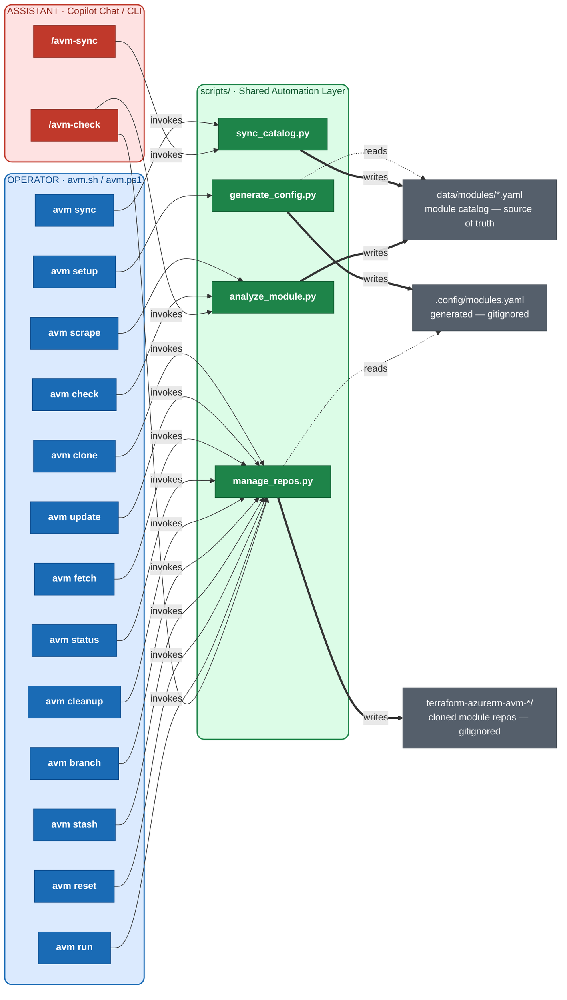

# Architecture Diagram — avm-metadata Workflows

> **Color key:**
> - **Blue** — Operator entry point and commands (`avm.sh` / `avm.ps1`)
> - **Red** — Assistant entry point (Copilot chat skills)
> - **Green** — Shared `scripts/` automation layer
> - **Grey** — Data / output layer (files and directories)

> **Edge key:**
> - Solid arrow `-->` — invokes
> - Thick arrow `==>` — writes
> - Dashed arrow `-.->` — reads
